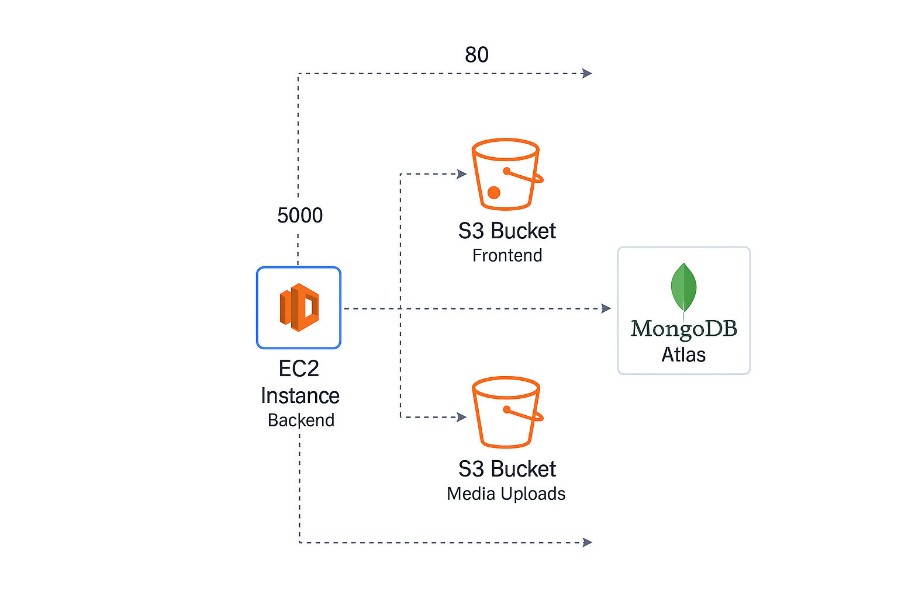

# MERN Stack Blog App Deployment with Terraform and Ansible
Scenario: Blog App Deployment
Deploy a MERN stack blog application on AWS. Backend will run on a single EC2 instance (Ubuntu 22.04),
frontend will be hosted via S3 static website hosting, and MongoDB Atlas will be used as the database. Media
uploads will be handled through a separate S3 bucket with proper IAM policies.

## ✅ Deployment Architecture

EC2 Instance (Ubuntu 22.04)

MongoDB Atlas

S3 Bucket (Frontend)

S3 Bucket (Media)

IAM User

## Clone your GitHub repo and prepare the folder
 ```bash
1. git clone https://github.com/manal-111/mern-blog-deployment.git
cd mern-blog-deployment
 ```
2. Create this project structure inside your repo folder:
  ```bash
mkdir terraform
mkdir ansible
mkdir screenshots
 ```
## 🧱 Infrastructure Setup (Terraform)
1.  Navigate to terraform/ and create the following:
main.tf

variables.tf

outputs.tf

provider.tf

2. Then run in terminal:
 ```bash
cd terraform
terraform init
terraform apply -var="key_name=your-aws-key-pair-name" -auto-approve
 ```
This creates your EC2 instance + security group.
## 🚫 Important Notes
NEVER commit .env, secrets, .terraform/ directory, or .pem files to GitHub.

Make sure .gitignore includes:
  ```bash
.env
.terraform
 ```
## 🔐 MongoDB Atlas Configuration

Go to MongoDB Atlas

Create a free-tier cluster

Whitelist your EC2 instance’s IP address

Create a DB user and get the connection string

This will be used in Ansible .env.j2

## 🛠️ Backend Provisioning (Ansible)
Navigate to ansible/

Add your EC2 DNS in inventory file:
 ```swift
[backend]
ec2-xx-xxx-xxx-xxx.eu-north-1.compute.amazonaws.com ansible_user=ubuntu ansible_ssh_private_key_file=C:/Users/user/.ssh/key.pem
 ```
Run the playbook:
 ```bash
ansible-playbook -i inventory backend-playbook.yml
 ```
## 🌐 Frontend Deployment (S3)
Go to frontend/ inside the repo

Create .env:

 ```env

VITE_BASE_URL=http://<ec2-public-dns>:5000/api
VITE_MEDIA_BASE_URL=https://<media-bucket>.s3.eu-north-1.amazonaws.com
Build and deploy:
 ```
Build and deploy
 ```bash

npm install -g pnpm
pnpm install
pnpm run build
aws s3 sync dist/ s3://<frontend-bucket-name>/
 ```
## 🧹 Cleanup

terraform destroy

Delete MongoDB Atlas IP rule

Remove secrets from EC2 (rm ~/.env)

Deactivate IAM keys 
## 📬 submitted by
Student Name: manal almuwallad
Course: Clarusway – DevOps Bootcamp – Infrastructure Module
